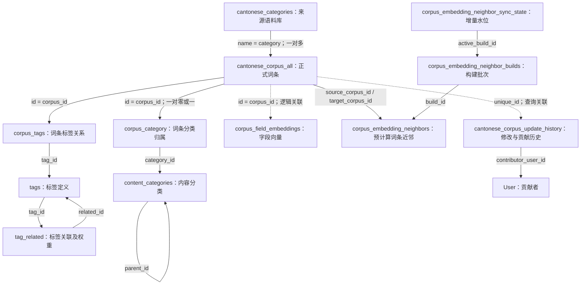

# 搜索逻辑、表关系与 Search 3.0 演变

核对日期：2026-09-10。代码基准：本地 HEAD `700834986101bb6db851e1caa843e269e5294b44`。

本记录对照本地代码、Git 历史和 Search 3.0 实施文档；没有连接生产数据库或重新验收线上服务。文档中的上线记录属于历史证据，不代表本次实时验证。Search 3.0 是功能版本；S6/S7 是工作归属周期，不能仅凭目录名称判断后续提交归属。

## 1. 总体演变

```text
旧版：关键词 → 繁简检索 → 合并去重 → 结果列表
  ↓ 2026-06-23 起
词条身份搜索：一个最佳词条 + 三条相关表达 + 四条推荐阅读
  ↓ 增加 query 向量、拆分加载、数据库 RPC
混合检索：文字负责精准，向量/标签/分类负责扩展
  ↓ 2026-08-26～27
性能优化：治理数据库竞争，预计算近邻，iad1 中继 query embedding
  ↓ 2026-08-28～09-07
Search 3.0 已落地部分：内容属性 + 媒体过滤 + 多媒体展示
  ↓ 仍需对接/验收
Agent 分类建议 → 人工确认 → 正式分类回写；统一公开分享上下文
```

3.0 沿用现有 `/api/search/entries` 和三层搜索，不重建搜索引擎，也不新建 Entry 主表。

## 2. 改之前：关键词列表搜索

历史基准：`6ba05d6^`，即首次引入词条身份搜索之前。

调用链：

```text
useSearchQuery / useSearch
  → backend /v2/text_search
  → Deno textSearchV2Handler
  → search_cantonese_corpus RPC（繁体、简体各调用一次）
  → 按 unique_id 合并去重
  → 可选 limit 截断
  → 按 category 过滤来源、排除 test 来源
  → 返回 SearchResult[]
```

- 用户输入关键词、选择来源语料库；虽然参数名叫 `table_name`，这里并不是动态切换物理表，实际是在结果上按 `category` 过滤。
- 每次 RPC 结果请求按 `id DESC` 排序；没有现有三段式的独立召回与排名。繁简结果合并之后也没有新的全局相关度排序。
- 主数据是 `cantonese_corpus_all`；`data` 为文本，`note.context` 放读音、释义、歌词、媒体等不同来源的数据。
- `cantonese_categories` 提供来源名称、显示昵称和编辑级别；前端按来源结构渲染内容。
- 旧处理器有“先 limit、后来源过滤”的顺序，指定 limit 时可能过滤后不足。
- 仓库可验证 RPC 的调用方式，不能据此断言旧 RPC 内部一定采用某种分词或排名算法；本次没有读取线上函数定义。

旧版入口目前仍保留。搜索页通过 `mode=entry` 进入三层模式，缺少该参数时走旧列表；首页正常新搜索入口会添加该参数，另有 legacy 分支。

## 3. 怎么演变到现在

| 日期 | 提交 | 变化 |
| --- | --- | --- |
| 2026-06-23 | `6ba05d6`、`4b12a66` | 新建 Entry API 和身份 DTO；精准 1 条、相关 3 条、推荐 4 条，最初主要依靠文字、标签、分类，随后合并 SQL 聚合 |
| 2026-06-24 | `b45165e`、`266ee14`、`2724b6b` | 对齐已有正式表；增加语料 `doc` 向量，早期使用精准词条的向量寻找近邻，并优化查询 |
| 2026-06-24～25 | `02e091e`、`d6b6d83`、`6910a46` | 引入用户 query embedding；拆开精准与语义加载；增加刷新和词条详情，精准查询/身份读取下沉 RPC |
| 2026-07-13 | `0c14422` | 来源选择限制精准结果；相关、推荐继续跨来源探索 |
| 2026-08-26 | `86b8701` | 治理数据库查询竞争、超时和降级路径 |
| 2026-08-27 | `9b3733c` | 引入离线近邻构建，用预计算结果扩展三级推荐 |
| 2026-08-27 | `9fbb9ec`、`eba9150` | query embedding 经 iad1 中继，并降低中继冷启动 |
| 2026-08-28 | `9079446` | 增加内容属性、媒体过滤及兼容 DTO；实施记录对应 PR #388 |
| 2026-08-28～09-07 | `2c9d6f2`、`18e7749`、`75fd640` | 媒体筛选、播放/降级、字幕与 3D Viewer 等界面整合；当前 HEAD 已包含这些代码 |

从“精准词条向量”改成“用户 query 向量”的意义是：即使找不到一级精准词条，仍可根据用户的原始搜索意图返回语义相近内容。

离线近邻解决的是另一个问题：三级推荐需要从相关词条继续扩散，历史实现存在昂贵的在线动态向量扫描。现在正常语义路径改为读取预计算近邻；向量生成、近邻构建与线上检索是三个不同步骤。

## 4. 当前搜索怎么工作

### 4.1 请求和加载

正式接口为 `GET /api/search/entries?q=...`，响应包含 `primary`、`similar`、`recommended`、分段状态和数字 offset 游标。

页面先请求 `section=primary`，取得精准词条内部 ID；随后请求 `section=semantic`，把 ID 作为种子。精准无结果或失败时传 `primaryCorpusId=none`，语义查询仍可运行。语义首次请求一般同时返回相关和推荐，之后可按区块换一批。

服务端也支持一次请求全部区块，此时精准和语义查询并发；这与页面的分步加载方式需要区分。

### 4.2 一级 primary：文字决定最佳词条

将关键词扩展成原始、简体、繁体变体，按以下优先级找 1 条：

```text
完全相同 → 忽略大小写相同 → 前缀 → PGroonga 全文命中 → 包含
```

同一匹配档位再按文本长度升序、浏览/收藏/点赞降序排列。一级不调用大模型，也不使用向量相似度决定首条。

不传内容属性时调用 `search_entry_primary(text[], text[])`，再通过 `get_entry_identities` 补齐身份；传内容属性时使用带属性条件的 SQL 实现同类排序。仓库旧 migration 只记录了单参数 RPC，当前调用方和契约已经使用双参数版本，不能把旧 migration 当成线上完整函数快照。

### 4.3 二级 similar：语义 + 标签 + 分类

1. 使用 `qwen3-vl-embedding` 为查询生成 1024 维向量。配置中继时经 `/api/search/embedding-relay`，该路由使用 Edge runtime、`preferredRegion=iad1`；未配置中继时可直连。
2. 查询 `corpus_field_embeddings` 中 `field_type='doc'` 的向量，按余弦距离召回最多 48 个候选行。
3. 合并与精准词条同标签、同二级分类的候选。
4. 分数相加后排序，排除精准词条，返回 3 条。

正常语义路径的实际权重：

| 因子 | 当前代码 |
| --- | --- |
| query 向量 | `100 × cosine similarity` |
| 命中一个精准种子已有标签 | `+35`，多个命中可累加 |
| 同二级分类 | `+25` |
| 浏览量 | `+ln(view_num + 1)` |
| 同分比较 | 收藏数、点赞数降序 |

这里不是直接照搬策略文档的建议权重。向量表允许同条语料存在多个字段/引用向量，SQL 先召回候选行再按语料聚合，因此“48 个候选”也不等于保证 48 个不同词条。

### 4.4 三级 recommended：向外扩展

候选来源及当前权重：

- query 向量候选以原分数的 `0.35` 加入。
- 开启离线近邻时，从 similar 词条读取 active build 的近邻，默认取每个种子的前 24 名，以 `similarity × 45` 加分；参数可配置。
- 从精准词条标签经 `tag_related` 找关联标签，再找到挂这些标签的词条；`manual/cooc/semantic` 分别按 `300/100/60 × score` 加权，其他方法为 `40 × score`。
- 同二级分类按 `ln(view_num+1)+5`、同一级分类按 `ln(view_num+1)+2` 加入。
- 合并排序，排除精准词条及未加媒体条件的当页 similar 集合，返回 4 条。

这是规则与语义混合的非个性化推荐；当前此 SQL 不读取用户画像，也没有使用 `recommend_words` 作为兜底候选。

### 4.5 过滤范围

| 参数 | 一级精准 | 二级相关 | 三级推荐 |
| --- | --- | --- | --- |
| `dataset` 来源 | 限制 | 不直接限制 | 不直接限制 |
| `contentAttribute` | 限制 | 限制 | 限制 |
| `mediaType` | 不过滤 | 过滤 | 不直接过滤，另见下方实现差异 |

`contentAttribute` 省略时不限制；显式只允许 `oral` / `cultural_knowledge`，不能用其他属性或 `unclassified` 补位。

`mediaType=text` 表示纯文本，即 `media_types={text}`；其他类型表示数组包含 `audio/video/image/model3d`。媒体条件在相关结果排名、分页前生效，但向量候选本身已有 48 行上限，因此不能将空媒体结果直接解释为全库没有该媒体。

### 4.6 缓存和降级

- query embedding 在进程内缓存 5 分钟，并合并相同请求；前端查询也缓存 5 分钟。
- 正常 Search 响应设置 CDN 60 秒缓存、300 秒 stale-while-revalidate；语义 error 响应不缓存。
- 语义全段 SQL 超时可尝试只查询 similar；临时数据库错误可返回语义 error 状态。
- embedding 不可用等情况回退到旧聚合查询。回退仍含“精准词条 doc 向量 + 标签 + 分类”的逻辑，不是纯标签兜底，也不走离线近邻；没有精准种子时召回能力会降低。

## 5. 对应表关系



上图同时表示外键和查询使用的逻辑关系；虚线不表示已声明数据库外键。

| 表或字段 | 含义与搜索用途 |
| --- | --- |
| `cantonese_corpus_all.id` | 内部数值 ID；分类、标签、向量、近邻用它关联 |
| `cantonese_corpus_all.unique_id` | 对外稳定 UUID；API entryId、详情、分享、历史追溯使用它 |
| `cantonese_corpus_all.category` | 来源名，关联 `cantonese_categories.name`；不是一级内容分类 |
| `content_categories` | 自关联分类树；搜索将 child 作为二级、parent 作为一级 |
| `corpus_category` | `corpus_id` 是主键，所以一条语料当前最多一条分类归属；不是多分类关系表 |
| `tags + corpus_tags` | 词条与标签多对多；旧主表 JSON `tags` 不是当前 Entry 标签聚合的主路径 |
| `tag_related` | 标签到标签的有向关联，保存方法和分数；不是词条之间的关系 |
| `corpus_field_embeddings` | 按语料、字段和内容引用存向量；当前文本搜索只用 doc，不能据多模态模型名称声称已实现图搜图或视频向量搜索 |
| `corpus_embedding_neighbors` | 词条到词条的有向近邻，存名次/距离/相似度，不复制向量 |
| `corpus_embedding_neighbor_builds` | 区分 building/ready/active 等批次，在线消费 active |
| `corpus_embedding_neighbor_sync_state` | 维护增量水位和执行状态；在线请求不负责构建 |
| `note / structured_note` | 媒体、粤拼、释义等资源事实；DTO 兼容新旧结构读取 |
| `cantonese_corpus_update_history` | 按 UUID 聚合贡献者 ID；不是每次搜索重新审批内容 |

例如一个“帆船”词条，可以来自某个资料集、属于一个二级主题、挂多个标签，同时拥有文字、音频和 3D 资源。来源、主题、标签、内容属性、媒体类型是五个独立维度。

## 6. 这次 Search 3.0 要升级成什么样

### 6.1 检索与媒体：已有落地

本期数据库实际收敛为主表两个新增字段，而不是最初草案的 14 字段、8 新表：

```text
cantonese_corpus_all.content_attribute
cantonese_corpus_all.media_types
```

- 内容属性区分“口语语料”和“文化知识”；`unclassified` 为内部迁移态。默认不筛属性，前端属性选择器明确延后。
- 媒体类型是可索引数组，由数据库函数/trigger 根据 `data/note/structured_note` 自动派生；属性用普通索引，媒体用 GIN 索引。
- URL、字幕仍读现有 JSON，不新增媒体资产表；音频/视频/图片/3D 可以共存。
- 一级展示完整词条身份，二级支持媒体筛选，三级继续用于探索。
- 当前代码已合入媒体筛选、音频播放、图片预览、视频懒加载及失败降级、字幕读取和 3D Viewer。不能继续笼统标记为“整个前端待实施”。
- 2026-09-11 补充核对：09 验收文档第八节明确视频关键帧、侧面板、App Sheet 和时间码转写不作为本轮发布条件，应按真实播放器实现验收，不计为本轮必做缺口。

### 6.2 分类治理与分享：还需要补齐闭环

目标分类流程：

```text
已有原始分类 → 直接采用、保留来源
缺二级分类 → Agent 给出一个候选和原文依据
  → 清晰单一：待抽检
  → 有歧义：AW 标注小程序人工确认/修改
  → 不适用或依据不足：留空
人工确认 → Fynn 服务回写正式 corpus_category
```

现有分类表继续保存正式可公开分类；未确认建议不应直接覆盖它。Agent 任务继续复用外部 `/tasks` 服务及现有代理，不预先建设第二套任务系统。本地是否新增一张轻量分类状态表，等契约和数据归属确认。

当前任务完成接口只向 Agent 提交结果，本仓库尚未形成对应的正式分类回写事务。外部 Agent 是否另行写库，本次无法验证。

分享方面已有 UUID 详情链接、卡片入口和预览基础；3.0 目标还包括 Fynn 提供统一公开权限及可信 share context，AW 渲染卡片。参考文档中的 `/api/internal/s6/entries/{entryId}/share-context` 未在当前路由中找到，不能当作已实现能力。

完整权利、训练许可、派生关系、条目发布状态字段，以及独立媒体/分享/任务表均已从当前立即迁移范围移出。PRD 中出现字段，不等于数据库已经落地该字段。

### 6.3 投稿与搜索保持业务边界

`corpus_collection_submissions` 保存征集投稿；正式搜索读 `cantonese_corpus_all`。现有审计记录指出，“投稿审核通过”与“正式词条入库”之间缺少转换和映射链路，不能假定通过后自动可搜。该 ingestion 问题在实施范围中列为独立需求。

## 7. 阅读当前文档时需要注意的差异

1. **文档状态过时**：3.0 README 写“前端待实施”，实施记录写“独立分支”；当前基准已包含媒体 UI 合并提交。它们不能代表当前全部代码状态。
2. **权重以代码为准**：旧策略文档的同标签 +60、同分类 +40 仍可在回退路径看到，正常 query 向量路径实际为 +35、+25。
3. **媒体稳定性存在实现边界**：方案 B 要求推荐保持稳定，页面切换媒体时保留已展示推荐；但语义 SQL 的离线近邻种子取自媒体过滤后的 `similar_ids`。直接调用包含推荐的过滤请求时，推荐候选可能间接受影响；排重使用的是未过滤 similar，因此也不能承诺过滤后的 related/recommended 永不重复。这是代码静态发现，尚未运行数据用例复现。
4. **标签三分组未完全建模**：当前 DTO 的 `tags.precise=[]`，已有标签归 related，扩展标签归 recommended；不存在已完整落库的三类标签角色系统。
5. **公开与审核规则未统一落地**：当前默认 Search 没有统一强制 `lifecycle_stage=normalized + 来源 is_public=true`；实施文档明确暂不新增这一门槛。DTO 直接生成分享链接，也不能替代目标中的 canShare 权限判定。
6. **线上状态证据有日期**：离线近邻已启用、字段已回填、PR #388 已验收来自 2026-08-27/28 的文档记录；本次只核对本地，不声称重新验证生产配置。

## 8. 依据

- [旧搜索处理器](../../deno/main.tsx)、[搜索客户端与新旧 hooks](../../main/lib/api/search.ts)。旧版对照：`git show 6ba05d6^:main/lib/api/search.ts` 和 `git show 6ba05d6^:deno/main.tsx`。
- [当前 Search API](../../main/app/api/search/entries/route.ts)、[页面加载与模式切换](../../main/app/[locale]/(home)/search/page.tsx)。
- [Entry DTO 组装](../../main/lib/search/entry-identity.ts)、[query embedding](../../main/lib/search/query-embedding.ts)、[中继路由](../../main/app/api/search/embedding-relay/route.ts)。
- [Prisma 表结构](../../main/prisma/schema.prisma)、[离线近邻构建脚本](../../main/scripts/build-corpus-embedding-neighbors.py)。
- [Search 3.0 总览](./s6-dimsum-search-system-upgrade-3.0/README.md)、[精简数据模型](./s6-dimsum-search-system-upgrade-3.0/02-data-model-and-migration.md)、[API 实施记录](./s6-dimsum-search-system-upgrade-3.0/11-search-v3-backend-implementation-record.md)。
- [入库审计](./s6-dimsum-search-system-upgrade-3.0/10-corpus-flow-and-ingestion-audit.md)、[分享服务参考契约](./s6-dimsum-search-system-upgrade-3.0/07-share-service-boundary.md)。
